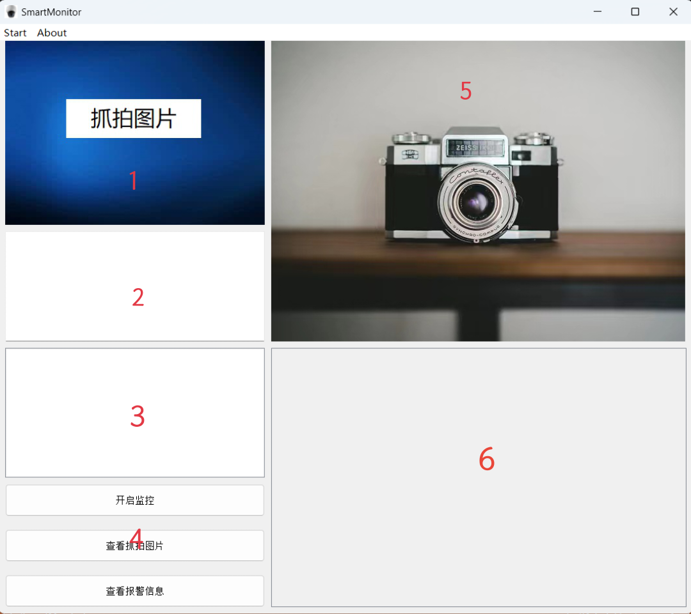

# SmartMonitor

## Project Instruction

***`SmartMonitor`*** is a kind of software for detecting abnormal people when monitoring in real-time. It is based on python and Qt, designed to solve detecting problems in specified places, e.g. plants, corridors, etc. We are proud of its user-friendly GUI:  

### Model Pretrained

1. **PaddlePaddle**: [Project source](https://aistudio.baidu.com/aistudio/projectdetail/4094475?channel=0&channelType=0&2.sUid=3098242&shared=1&ts=1679025062935 "Open-source project on Baidu PaddlePaddle")
2. Github：[PULC_person_exists](https://github.com/PaddlePaddle/PaddleClas/blob/release/2.4/docs/zh_CN/PULC/PULC_person_exists.md)  
3. Github: [PULC_person_attribute](https://github.com/PaddlePaddle/PaddleClas/blob/release/2.5/docs/zh_CN/models/PULC/PULC_person_attribute.md)

## Project Dependencies

### Python Environment

    prefer python3.8.x while python >= 3.6.0 will be ok

#### Conda Virtual Environment

1. create a virtual environment:
    `conda create -n env_monitor`

2. activate "env_monitor":
    `conda activate env_monitor`

3. check package list in current env:
    `conda list`

### Python Packages

1. for train:  
    paddlepaddle if using cpu:  
    `python -m pip install paddlepaddle -i https://mirror.baidu.com/pypi/simple`  
    paddlepaddle-gpu if CUDA installed:  
    `python -m pip install paddlepaddle-gpu -i https://mirror.baidu.com/pypi/simple`

2. for predicting results and building GUI:  
    `pip install -r requirements.txt`  
    required packages: numpy==1.24.2, opencv_python==4.7.0.72, paddle==1.0.2, paddleclas==2.5.1, PyQt5==5.15.9

## Project Frame

The project includes 6 folders:  

1. [`.vscode`](.vscode) includes a [`launch.json`](.vscode/launch.json) for python executive.
2. [`log`](log) is a resource folder, includes a [`warning.txt`](log/warning.txt) for users to check when they use the software.  
3. [`pic`](pic) is a resource folder, includes several pictures and icons for GUI appearance.  
4. [`camera_cap`](camera_cap) is a resource folder, includes two folders:  
    1. [`all`](camera_cap/all) stores all shots in real-time.
    2. [`positive`](camera_cap/positive) stores the shots that contain people in real-time.
5. [`models`](models) includes required model files (`.pdiparams` and `.pdmodel`), produced after model pretrained.  
6. [`src`](src) includes required `.py` files and a `.ui` file.

## Attention

1. [main.py](src/main.py) is the main `output` file.  
2. [FPS_test](src/FPS_test.py) is a separate `.py` file for **testing the FPS of specified camera**.  
